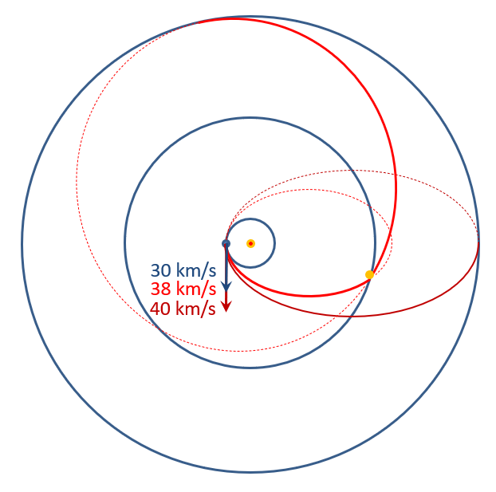

[TOC]

# 太阳系中的科学

## 第一讲

### 地心说

- 估算地球直径：埃拉托色尼方法
- - 观测现象：群星围绕北极星做圆周运动
  - 解释：柏拉图和日心说
  - 挑战：不同季节太阳高度不同
- - 观测现象：夜空中最亮的几颗星在黄道十二宫之间穿行
  - 改进：存在多个转动速度各异的天层
- - 观测现象：行星逆行
  - 改进：引入本轮，本轮绕均轮移动

### 日心说

“金有阴晴圆缺”

## 第二讲：天体的轨道

### 太阳系中的天体及发现

- 谷神星：小行星带中的最大天体，由意大利神父朱塞佩·皮亚齐于1801年发现。高斯使用最小二乘法计算谷神星的轨道。
- 海王星：Le Verrier 和 Adams 各自独立的预测了天王星以外行星的轨道，并导致了海王星的发现
- 冥王星：海王星轨道与预测轨道的偏离导致人们猜测，在其外仍有一颗大行星对海王星及天王星的轨道造成影响。为此，Percival Lowell 建立了 Lowell 天文台，以寻找Planet X。

- **行星的定义**：
  - 直接围绕太阳公转
  - 自身引力足以克服刚体力，从而呈现流体静力学平衡态
  - 将临近轨道上的天体清除（冥王星未满足，存在阋神星）
  - 未能发生核聚变

### 拉格朗日点

## 第三讲：潮汐

### 潮汐力

当潮汐力大于自身引力时，物体将被撕碎，即：
$$
\frac{GMu}{(d-r)^2} - \frac{GMu}{d^2} > \frac{Gmu}{r^2}\\
d < r (\frac{2M}{m})^{1/3}= 1.26R \left(\frac{\rho_M}{\rho_m}\right)^{1/3}
$$
后者成为 **洛希极限**。

### 土星环

- 惠更斯的猜想：**薄且平坦的环**
- 土星环并非连续的固态结构
- 拉普拉斯证实了这一点并提出猜想：土星环由大量的小环构成
- 麦克斯韦进一步证实，大量的小环结构仍是不稳定而易碎的。他提出：土星环由众多围绕土星运动的小颗粒组成

### 潮汐锁定

#### 地球与月球之间的潮汐作用

地球对月球的潮汐作用使月球自转速度与环绕地球公转速度始终保持一致。月球两端受地球万有引力的不同 (即潮汐力) 使月球旋转速度逐渐变慢。

潮汐力使地球自转变慢(~15 μs/year)。与此同时，月球的公转速度提高，从而使月球逐渐远离地球(~3.8 cm/year)

#### 太阳与水星之间的潮汐作用

二者未能发生潮汐锁定，但出现了 3:2 的轨旋共振：水星公转周期约90天，水星自转周期约60天。这与水星椭圆形轨道有关。

#### 逆行的海卫一

海卫一此前被海王星捕获，并仍在逐渐靠近海王星。

海卫一所受万有引力除提供向心力外，还可使其减速，从而使海卫一逐渐接近海王星。

#### 木星系与潮汐

- 卫星沿椭圆轨道绕行星公转，卫星被潮汐力反复的压缩与拉伸，即潮汐摩擦加热。

- 在近木点，卫星公转速度较大，自转将落后于公转，反之自转将超前，使卫星轨道趋于圆形。
- 三个伽利略卫星的拉普拉斯共振
  - Io 的公转周期为 Europa 的 1/2，为 Ganymede 的 1/4。
  - Io 总在同一位置与 Europa 及 Ganymede 的距离达到最小，三者之间的周期性引力作用使其轨道无法演变至圆形。
  - 拉普拉斯共振还具有稳定轨道的效果。

- 越远离木星，潮汐作用依次减弱，地质活动越弱。
- **木卫二 (Europa)**
  - 目前认为 Europa 的液态水含量超过地球
  - 电磁感应的证据：木星旋转使木星的磁场发生周期性变化
  - 伽利略号卫星的磁场观测：在临近Europa处出现强烈磁场扰动，来自于木星旋转所造成的感应电流，反演结果与咸水海洋模型一致。
  - 哈勃望远镜的极紫外观测：多次发现Europa南极附近存在间歇性喷泉，可达200公里高度。

## 第四讲：太空时代

### 齐奥尔科夫斯基火箭方程

动量守恒：$mδV=-δmV_e$
$$
\frac{\mathrm{d}V}{\mathrm{d}t}=-\frac{V_e}{m}\frac{\mathrm{d} m}{\mathrm{d}t}=-V_e\frac{{\rm d}(\ln m)}{\mathrm{d}t}
$$
求积分：
$$
V_1-V_0=V_e\ln\left(m_0/m_1\right)
$$
对运载系统的设计建议：推广等离子体发动机、应用多级火箭技术。

#### 辐射带

## 第八讲：外太阳系

### 向外太阳系进发

木星等星球的引力助推，帮助航天器飞向远方（土星等）。设计轨道使得引力方向与飞船速度相同，可以加速卫星，节省燃料

旅行者号：穿越了系内所有巨行星，已经飞出日球层

### 日球层

#### 概念

- 日冕：太阳高层大气，因其极为稀薄，仅当光球层被遮挡时可见

- 太阳风：日冕物质的逃逸（等离子体）

- 磁场冻结现象：太阳磁场磁感线跟随行星运动
- **日球层：太阳物质与太阳磁场所控制的空间区域**
- 终止激波：超声速与亚音速太阳风的分界面

如何判断卫星已飞离日球层？

- 星际介质密度的剧增

- 等离子体停止外流

- 银河宇宙线通量的增强

- 太阳高能粒子数量的剧减
- 磁场改变方向

### 太阳系的边界

**太阳系：轨道受太阳引力约束的天体系统总称**

**奥尔特云：目前公认的太阳系边界，最大半径约1光年**

## 第九讲：巨行星

### 木星系

#### 木星

- 公转周期：12年  

- 自转周期：9.9h  

  赤道半径比极半径长7%  自转周期通过灯塔效应测定：用射电望远镜观测蟹状星云时出现源自木星的强烈干扰

- 有强大的磁场，形成巨大的磁层

- 大红斑：长期的大风暴

- 木星极光：紫外波段、结构复杂、永不熄灭

卫星越远离木星，潮汐作用依次减弱，地质活动减弱

镶嵌的磁层系统：木卫三也拥有磁层

### 土星系

探测：卡西尼号卫星

#### 土星

- **土星环**

  卡西尼发现土星环缝(1675年)

  来源：**轨道共振**

  土卫一(Mimas)与卡西尼环缝发生2:1轨道共振

  环缝处颗粒可周期性的受到土卫一同一方向的引力拉拽

- 土星辐射带：在光环和各卫星处消失
- 北极六边形

#### 土星的卫星

- 土卫二：直径约500km(土卫六的1/10)。反照率超过99%，太阳系内最高。 南极喷出羽状水/冰雾可达500km高度，以至形成了土星光环E环
- 土卫一：直径约400km。太阳系内已确认的球形天体中最小。

如何同时解释土卫二活跃的喷泉和土卫一的密集陨石坑？

目前解释：土卫一温度较低，冰的刚性较强(剪切模量较大）

- 土卫八：“阴阳”天体：反照率3%-60%。解释：反照率较低区域吸收大量光，表面冰升华进一步降低反照率，形成正反馈

### 天王星系

五颗球形卫星   天卫五：极端地形，如太阳系内最深的悬崖(深20km)

使用掩星法观测天王星大气时发现光环

公转周期84年，自转倾角97.8->独特的季节变换和时间尺度（相当部分区域均可经历多年的极昼和极夜，其中在极区，极昼极夜均长达42年）->大气层活跃程度变化

天王星存在很强的磁场，但磁源存在严重的偏心和倾斜

### 海王星系

海卫一逆行环绕海王星，并逐渐向其靠近（海卫一所受万有引力除提供向心力外，还可使其减速，从而使其逐渐接近海王星）。独特的冰火山

海王星虽距太阳更加遥远，但大气活动更剧烈（一般认为与海王星内部丰富的热流有关）
